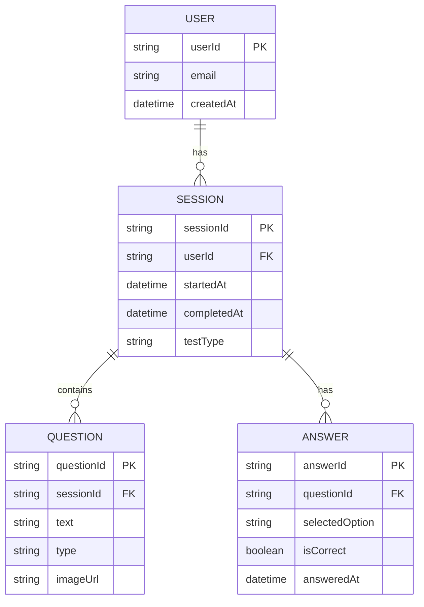
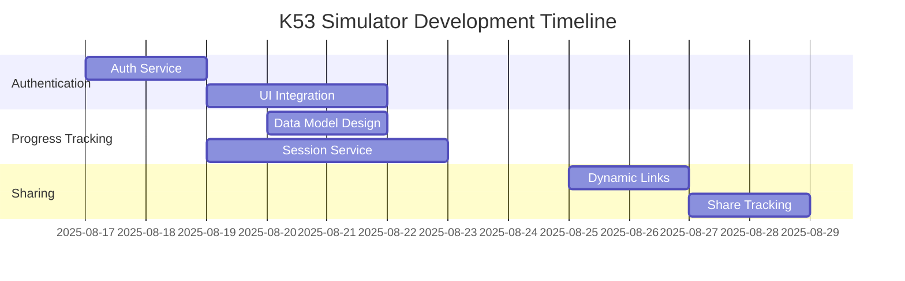

# K53 Simulator Implementation Plan

## 1. Authentication System
### Firebase Auth Implementation
```dart
// lib/services/auth_service.dart
import 'package:firebase_auth/firebase_auth.dart';

class AuthService {
  final FirebaseAuth _auth = FirebaseAuth.instance;

  // User state stream
  Stream<User?> get user => _auth.authStateChanges();

  // Sign in with email/password
  Future<User?> signIn(String email, String password) async {
    try {
      UserCredential result = await _auth.signInWithEmailAndPassword(
        email: email, 
        password: password
      );
      return result.user;
    } catch (e) {
      print("Sign in error: $e");
      return null;
    }
  }

  // Register new user
  Future<User?> register(String email, String password) async {
    try {
      UserCredential result = await _auth.createUserWithEmailAndPassword(
        email: email, 
        password: password
      );
      return result.user;
    } catch (e) {
      print("Registration error: $e");
      return null;
    }
  }

  // Sign out
  Future<void> signOut() async {
    await _auth.signOut();
  }
}
```

## 2. Session & Progress Tracking
### Firestore Data Structure


## 3. WhatsApp Sharing & Tracking
### Implementation Components
```dart
// lib/services/share_service.dart
import 'package:share_plus/share_plus.dart';

class ShareService {
  static Future<void> shareProgress(String sessionId) async {
    final dynamicLink = await _createDynamicLink(sessionId);
    await Share.share(
      'Check out my K53 test results! $dynamicLink',
      subject: 'My Driving Test Progress'
    );
    _trackShareEvent(sessionId);
  }

  static Future<String> _createDynamicLink(String sessionId) async {
    // Firebase Dynamic Links implementation
    return 'https://k53simulator.page.link/results?session=$sessionId';
  }

  static void _trackShareEvent(String sessionId) {
    // Log share event to Firestore
  }
}
```

### Tracking Mechanism
1. **Dynamic Links** - Firebase Dynamic Links with UTM parameters
2. **Analytics** - Firestore event tracking:
   - `share_initiated`: When user taps share button
   - `link_generated`: When dynamic link is created
   - `link_accessed`: When someone opens the link
   - `referral_converted`: When new user registers via shared link

## 4. Integration Plan


## Next Steps
1. Implement authentication service
2. Design session data model
3. Create dynamic link generator
4. Build analytics dashboard